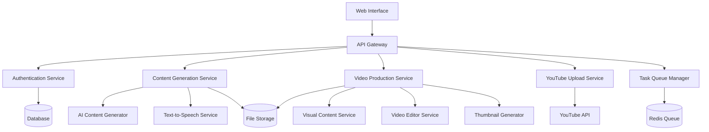

# Design Document

## Overview

YouTube Otomasyon Sistemi, kullanıcı tarafından verilen konuları otomatik olarak videoya dönüştüren ve YouTube'da yayınlayan kapsamlı bir sistemdir. Sistem mikroservis mimarisinde tasarlanmış olup, her bileşen bağımsız olarak çalışabilir ve ölçeklenebilir.

## Architecture

### High-Level Architecture



### System Components

1. **Web Interface**: React-based kullanıcı arayüzü
2. **API Gateway**: Express.js ile RESTful API
3. **Authentication Service**: OAuth 2.0 YouTube entegrasyonu
4. **Content Generation Service**: AI tabanlı içerik üretimi
5. **Video Production Service**: Video montaj ve üretim
6. **YouTube Upload Service**: Otomatik yükleme ve metadata yönetimi
7. **Task Queue Manager**: Asenkron işlem yönetimi

## Components and Interfaces

### 1. Content Generation Service

**Responsibilities:**
- Konu analizi ve senaryo üretimi
- Text-to-speech dönüşümü
- İçerik optimizasyonu

**Interfaces:**
```typescript
interface ContentGenerationService {
  generateScript(topic: string, duration: number): Promise<Script>
  generateSpeech(script: Script, voice: VoiceConfig): Promise<AudioFile>
  optimizeContent(content: string, targetDuration: number): Promise<string>
}

interface Script {
  id: string
  topic: string
  content: string
  estimatedDuration: number
  sections: ScriptSection[]
}
```

**Technology Stack:**
- OpenAI GPT-4 API for script generation
- ElevenLabs or Azure Cognitive Services for TTS
- Node.js runtime

### 2. Video Production Service

**Responsibilities:**
- Görsel içerik bulma ve hazırlama
- Video montajı ve düzenleme
- Thumbnail oluşturma

**Interfaces:**
```typescript
interface VideoProductionService {
  findVisualContent(topic: string, duration: number): Promise<VisualContent[]>
  createVideo(audio: AudioFile, visuals: VisualContent[]): Promise<VideoFile>
  generateThumbnail(topic: string, style: ThumbnailStyle): Promise<ImageFile>
}

interface VisualContent {
  type: 'image' | 'video' | 'animation'
  source: string
  duration: number
  startTime: number
}
```

**Technology Stack:**
- FFmpeg for video processing
- Unsplash/Pexels API for stock content
- Canvas API for thumbnail generation
- Python with MoviePy for advanced editing

### 3. YouTube Upload Service

**Responsibilities:**
- YouTube API entegrasyonu
- Video yükleme ve metadata yönetimi
- Yayın durumu kontrolü

**Interfaces:**
```typescript
interface YouTubeUploadService {
  uploadVideo(video: VideoFile, metadata: VideoMetadata): Promise<UploadResult>
  updateVideoStatus(videoId: string, status: VideoStatus): Promise<void>
  getVideoStats(videoId: string): Promise<VideoStats>
}

interface VideoMetadata {
  title: string
  description: string
  tags: string[]
  category: string
  thumbnail: ImageFile
  privacy: 'public' | 'private' | 'unlisted'
}
```

**Technology Stack:**
- YouTube Data API v3
- OAuth 2.0 for authentication
- Google Client Libraries

### 4. Task Queue Manager

**Responsibilities:**
- Asenkron işlem yönetimi
- İş sırası kontrolü
- Hata yönetimi ve yeniden deneme

**Interfaces:**
```typescript
interface TaskQueueManager {
  addTask(task: VideoProductionTask): Promise<string>
  getTaskStatus(taskId: string): Promise<TaskStatus>
  processQueue(): Promise<void>
  retryFailedTasks(): Promise<void>
}

interface VideoProductionTask {
  id: string
  userId: string
  topic: string
  status: 'pending' | 'processing' | 'completed' | 'failed'
  progress: number
  createdAt: Date
  completedAt?: Date
}
```

**Technology Stack:**
- Redis for queue management
- Bull.js for job processing
- Node.js worker processes

## Data Models

### Core Entities

```typescript
// User Management
interface User {
  id: string
  email: string
  youtubeChannelId?: string
  accessToken?: string
  refreshToken?: string
  preferences: UserPreferences
  createdAt: Date
}

interface UserPreferences {
  defaultVoice: string
  defaultCategory: string
  defaultPrivacy: 'public' | 'private' | 'unlisted'
  videoStyle: 'educational' | 'entertainment' | 'news'
  thumbnailStyle: 'minimal' | 'colorful' | 'professional'
}

// Content Management
interface Project {
  id: string
  userId: string
  name: string
  topics: string[]
  status: 'draft' | 'processing' | 'completed'
  videos: Video[]
  createdAt: Date
}

interface Video {
  id: string
  projectId: string
  topic: string
  script: Script
  audioFile?: string
  videoFile?: string
  thumbnailFile?: string
  youtubeVideoId?: string
  status: VideoStatus
  metadata: VideoMetadata
}

// Processing Pipeline
interface ProcessingPipeline {
  videoId: string
  steps: PipelineStep[]
  currentStep: number
  status: 'running' | 'completed' | 'failed'
  startTime: Date
  endTime?: Date
}

interface PipelineStep {
  name: string
  status: 'pending' | 'running' | 'completed' | 'failed'
  startTime?: Date
  endTime?: Date
  error?: string
}
```

### Database Schema

**PostgreSQL Tables:**
- `users` - Kullanıcı bilgileri ve YouTube hesap bağlantıları
- `projects` - Video projeleri ve toplu işlemler
- `videos` - Tekil video kayıtları ve durumları
- `processing_logs` - İşlem geçmişi ve hata kayıtları
- `user_preferences` - Kullanıcı tercihleri ve ayarları

## Error Handling

### Error Categories

1. **User Input Errors**
   - Geçersiz konu formatı
   - Eksik YouTube yetkilendirmesi
   - Quota aşımları

2. **External Service Errors**
   - AI API hataları
   - YouTube API hataları
   - TTS servis hataları

3. **System Errors**
   - Video işleme hataları
   - Dosya sistemi hataları
   - Network bağlantı sorunları

### Error Handling Strategy

```typescript
interface ErrorHandler {
  handleError(error: SystemError): Promise<ErrorResponse>
  retryOperation(operation: () => Promise<any>, maxRetries: number): Promise<any>
  logError(error: Error, context: ErrorContext): void
}

interface SystemError {
  code: string
  message: string
  category: 'user' | 'external' | 'system'
  retryable: boolean
  context: any
}
```

**Retry Logic:**
- External API calls: 3 attempts with exponential backoff
- File operations: 2 attempts with 1-second delay
- YouTube uploads: 5 attempts with progressive delay

**User Notifications:**
- Real-time progress updates via WebSocket
- Email notifications for completed/failed batches
- In-app error messages with suggested actions

## Testing Strategy

### Unit Testing
- Service layer logic testing
- API endpoint testing
- Data model validation testing
- Error handling scenarios

### Integration Testing
- External API integration tests
- Database operation tests
- File system operation tests
- End-to-end pipeline tests

### Performance Testing
- Video processing performance benchmarks
- Concurrent user load testing
- Memory usage optimization tests
- API response time measurements

### Test Environment Setup
```typescript
// Test configuration
interface TestConfig {
  mockExternalAPIs: boolean
  useTestDatabase: boolean
  enableVideoProcessing: boolean
  maxTestDuration: number
}

// Mock services for testing
interface MockServices {
  aiContentGenerator: MockAIService
  textToSpeech: MockTTSService
  youtubeAPI: MockYouTubeService
  visualContentAPI: MockVisualService
}
```

### Automated Testing Pipeline
- Pre-commit hooks for code quality
- CI/CD pipeline with automated tests
- Staging environment for integration testing
- Production monitoring and alerting

## Security Considerations

### Authentication & Authorization
- OAuth 2.0 for YouTube API access
- JWT tokens for session management
- Role-based access control
- API rate limiting

### Data Protection
- Encrypted storage for sensitive tokens
- HTTPS for all API communications
- Input validation and sanitization
- SQL injection prevention

### Privacy Compliance
- User data anonymization options
- GDPR compliance for EU users
- Data retention policies
- User consent management

## Scalability & Performance

### Horizontal Scaling
- Microservice architecture for independent scaling
- Load balancing for API gateway
- Queue-based processing for video generation
- CDN for static content delivery

### Performance Optimization
- Caching strategies for frequently accessed data
- Async processing for long-running operations
- Resource pooling for video processing
- Database query optimization

### Monitoring & Observability
- Application performance monitoring
- Error tracking and alerting
- Resource usage metrics
- User behavior analytics